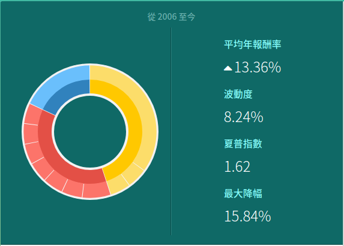

# Introduction to FinTech Assignment #3
## B05102074 何青儒
***

Test your portfolio on https://www.tradingvalley.com.

### Sharpe Ratio

> 1.62

***

### Screen shot the output of your Sharpe ratio from your monitor

***

### List assets of your portfolio

- 各類債券：45.03%	
	- MUB／iShares 美國市政債券 ETF：35.00%	
	- BIV／Vanguard 美國中期債券 ETF：5.03%	
	- TLT／iShares 20 年期以上美國公債 ETF：5.00%

- 美國股市：37.02%
	- GOOG／Alphabet Inc：6.95%	
	- MSFT／Microsoft Corporation：5.06%	
	- INTC／Intel Corporation：5.01%	
	- TSM／Taiwan Semiconductor Mfg. Co. Ltd. (ADR)：5.00%	
	- AMZN／Amazon.com, Inc.：5.00%	
	- NVDA／NVIDIA Corporation：5.00%	
	- SQ／Square Inc：5.00%

- 原物料：17.95%
	- IAU／iShares 黃金信託 ETF：17.95%	