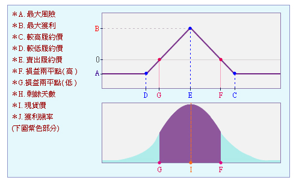

## 「買進蝶式價差策略單」

B05102074 經濟三 何青儒

***

#### 組合策略說明

在選擇權市場上，最簡單的組合價差單有以下兩種：

- 牛市價差單：也就是看多市場。此時會買入低履約價的期權，賣出高履約價的期權。
- 熊市價差單：也就是看空市場。此時會賣出低履約價的期權，買入高履約價的期權。

而所謂的「蝶式價差策略單」，就是同時買入或賣出「兩種熊市價差單和牛市價差單」。因為我們在操作的時候，買入和賣出的口數相同，所以賣出的期權和買入的期權會互相觸價止損，也就是說，**這種策略可以將風險和虧損控制在一定的範圍之內**。

以**「買進蝶式價差策略單」**為例，當人們預測標的未來的市場價格不會偏離當前價格太多時，也就是**進入盤整狀態**時，會同時買進一組低履約價的牛市價差和買進一組高履約價的熊市價差，其中**「牛市價差單」中的「買入之高履約價」和「熊市價差單」的「賣出之低履約價」相同**。

換句話說，在這個策略當中，我們會買入兩口選擇權、賣出兩口選擇權、共有三種不同的履約價格。
- 買進「一口」價格低於當前履約價的call（低履約價）
- 買進「一口」價格高於當前履約價的call（高履約價）
- 賣出「兩口」和當前履約價相當的call（中間履約價）

這種「買進蝶式價差策略單」**最大利潤**會發生在**「標的到期價格等於中間履約價」**之時；若標的現貨價格在到期時**「收在最低履約價以下或最高履約價以上」**，則將有**最大損失**。

####　使用情境

舉例來說，如果當前市場有一個標的指數在 1000 點，我們預測到期時指數不變，則此時策略為：

- 買進履約價 800 點買權，支付 30 點權利金
- 賣出履約價 1000 點買權，收取 10 點權利金
- 買進履約價 1200 點買權，支付 5 點權利金

此時，我們權利金淨支出為 15 點（10*2 - 5 - 30 = -15）。

該策略之最大損失為到期日指數低於 800 點或高於 1200 點，使得全部口數都變成無價值期權，淨損權利金 15 點；而最大利潤則發生在到期價格仍為 1000 點時，此時賣出的 1000 和買入的 1200 雖無價值，但買入的 800 點會淨賺 185 點（1000 - 800 - 15 = 185，其中 15 為權利金）。

#### 套利機會

換句話說，當標的市場價格趨近穩定，希望可以在高履約價和低履約價的價格區間獲利，則我們就可以透過這種一次買入熊市價差單和牛市價差單的蝶式策略，在兩種價差之間對沖了結。如果市場真的跟我們預測的一樣在小幅度之間波動則我們可以獲利；而可能的最大損失也只限於所支付的權利金。

***

附圖：如圖所示，蝶式策略單的損利線與獲利機率以形似蝴蝶而得名。

#### Reference

1. https://www.pfcf.com.tw/product/detail/980
2. https://wiki.mbalib.com/zh-tw/%E8%9D%B6%E5%BC%8F%E5%A5%97%E5%88%A9
3. http://www.moneyweekly.com.tw/Journal/article.aspx?UIDX=13898141660